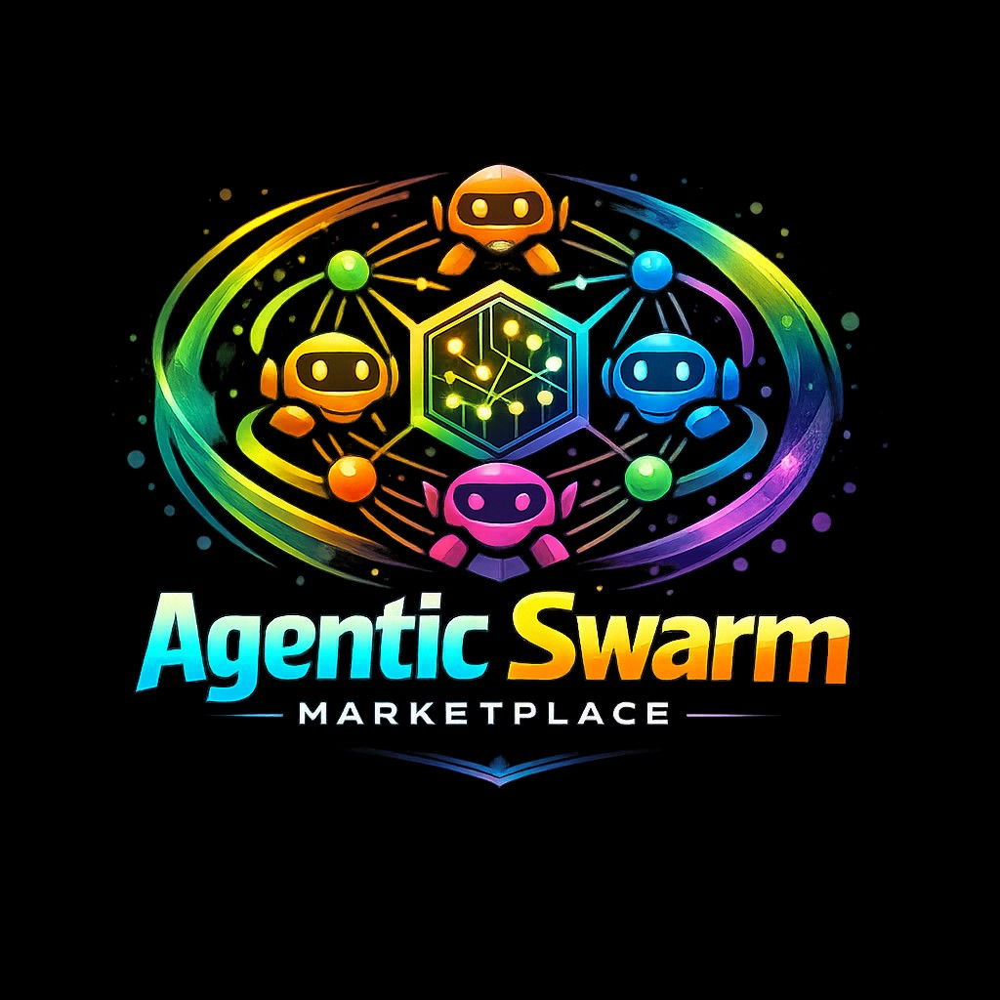

<p align="center">
  
</p>

<p align="center">
  <a href="https://hobie1kenobi.github.io/agentic-crypto-swarm-prototype/"><strong>Live dashboard &amp; documentation (GitHub Pages)</strong></a>
  · <a href="https://hobie1kenobi.github.io/agentic-crypto-swarm-prototype/llms.txt">llms.txt</a>
  · <a href="https://hobie1kenobi.github.io/agentic-crypto-swarm-prototype/mcp-integration.md">MCP setup</a>
  · <a href="DIRECTORY_SUBMISSION_KIT.md">Directory submission kit</a>
</p>

<p align="center">
  <a href="https://hobie1kenobi.github.io/agentic-crypto-swarm-prototype/mcp-integration.md"></a>
  <a href="https://www.base.org/"></a>
  <a href="https://xrpl.org/"></a>
  <a href="https://olas.network/"></a>
  <a href="https://www.celo.org/"></a>
</p>

# Agentic Crypto Swarm Prototype

A hierarchical multi-agent system that autonomously earns testnet revenue through on-chain value creation — no trading, no speculation. **Celo-first:** Celo Sepolia (testnet), Celo mainnet (production); local Anvil for zero-faucet testing; optional Base/Polygon paths.

**Layout:** long-form manuals live under **`documentation/`** (see `documentation/README.md`). Generated soak reports, traces, proof bundles, and communication traces live under **`artifacts/`** (see `artifacts/README.md`). The **`docs/`** folder is reserved for **GitHub Pages** (`index.html`, `endpoints.json`, sitemap, discovery scans linked from the site).

---

<br>

<div align="center">

## Completed: T54 x402 seller on XRPL

**Machine-paid APIs — HTTP 402 — XRP settlement via [T54 facilitator](https://xrpl-facilitator-mainnet.t54.ai) (`xrpl:0`)**

[](https://www.x402.org/)
[](https://xrpl.org/)
[](https://github.com/ChainAgnostic/CAIPs)
[](https://xrpl-facilitator-mainnet.t54.ai)

</div>

| | |
| :--- | :--- |
| **What it is** | A **production-pattern T54 seller**: a FastAPI server that returns **402 Payment Required** with **x402 v2** terms for **XRPL mainnet**. Buyers complete payment in XRP; **[`xrpl-facilitator-mainnet.t54.ai`](https://xrpl-facilitator-mainnet.t54.ai)** verifies and settles. The seller holds **no signing keys** — only your **receive address** (`r...`). |
| **What it does** | **Multi-SKU** paid `GET` routes with **Pydantic-validated JSON** and per-route **prices in drops** (see [`packages/agents/config/t54_seller_skus.json`](packages/agents/config/t54_seller_skus.json)): micropayment ping (`/hello`), short constitution-safe Q&A (`/x402/v1/query`), structured research brief (`/x402/v1/research-brief`), and heuristic prompt/ethics review (`/x402/v1/constitution-audit`). **`GET /health`** is free and lists SKUs. Discovery builds public **`resource_url`**s from **`T54_SELLER_PUBLIC_BASE_URL`** + each path ([`x402_providers.json`](packages/agents/config/x402_providers.json)). |
| **Docs & ops** | **[documentation/x402-t54-base/T54_SELLER.md](documentation/x402-t54-base/T54_SELLER.md)** — env vars, ngrok, 24/7 startup. Mainnet + hybrid notes: **[documentation/celo-xrpl/MAINNET_CELO_XRPL_T54.md](documentation/celo-xrpl/MAINNET_CELO_XRPL_T54.md)**. Task review: **[documentation/x402-t54-base/T54_GROK_TASK_REVIEW.md](documentation/x402-t54-base/T54_GROK_TASK_REVIEW.md)**. |

<details>
<summary><b>Quick commands</b> (expand)</summary>

| Goal | Command |
|------|---------|
| Run seller locally | `npm run t54:seller` |
| Seller + ngrok + sync `.env` from tunnel | `npm run t54:stack:start` then `npm run t54:sync-ngrok-env` |
| Reload discovery output | `npm run t54:reload-discovery` |
| Buyer / marketplace cycle (test) | `npm run t54:cycle` |

</details>

### All paid / commerce surfaces in this repository

| Surface | How to run | Rail / asset |
|--------|------------|----------------|
| **T54 XRPL x402 seller** | `npm run t54:seller` | XRP · `xrpl:0` · T54 facilitator |
| **T54 stack** (seller + tunnel helper) | `npm run t54:stack:start` | Same (orchestration script) |
| **Celo native x402 API** | `npm run api:402` | CELO · on-chain `fulfillQuery` |
| **Base Sepolia x402 seller** (facilitator / Bazaar path) | `packages/agents/api_seller_x402.py` | USDC · facilitator |
| **Compute marketplace** | `npm run miner` · `npm run validator` | Celo · escrow / scoring |
| **Multi-rail hybrid demo** | `npm run demo:multi-rail` | Celo + XRPL composition |
| **External x402 discovery** | `packages/agents/external_commerce/discovery.py` + [`x402_providers.json`](packages/agents/config/x402_providers.json) | Catalog of providers |
| **Airdrop intelligence & EVM claims** | `npm run airdrop:intake` · `npm run airdrop:pipeline` · `npm run airdrop:pull-catalog` · `npm run airdrop:catalog:base` · `npm run airdrop:claim:recon` · `npm run airdrop:claim:verify` · `npm run airdrop:claim:spec-from-merkle` · `npm run airdrop:claim` | **`airdrop:intake`** writes `external_commerce_data/airdrop_intake_snapshot.json` (catalog + LLM scout + per-chain filters + recon). Then queue `ClaimSpec` → approve → dry-run → execute; [AIRDROP_CLAIM_EXECUTION.md](documentation/discovery/AIRDROP_CLAIM_EXECUTION.md) · [CLAIM_EXTRACT_AND_VERIFY.md](documentation/discovery/CLAIM_EXTRACT_AND_VERIFY.md) |
| **Sellable dashboard bundle (Stripe MPP)** | `npm run marketplace:pack` (writes `dist/...-latest.zip`) · `npm run marketplace:webhook-dev` · `npm run marketplace:order` · [documentation/marketplace-stripe/MARKETPLACE_DASHBOARD_BUNDLE.md](documentation/marketplace-stripe/MARKETPLACE_DASHBOARD_BUNDLE.md) | USD · Tempo crypto deposit (`npm run marketplace:serve`) |
| **Unified reverse proxy (one HTTPS host)** | `npm run proxy:unified` → `:9080` · [scripts/reverse-proxy/README.md](scripts/reverse-proxy/README.md) · `npm run ngrok:dual` (three tunnels incl. unified) or `npm run ngrok:unified` | Routes `/x402/*`, `/t54/*`, `/webhooks/*` to Base, T54, marketplace |

---

## Architecture

```
Human (seeds ETH + goals)
    │
    ▼
Root Strategist (ERC-4337 smart account)
    │
    ├──► IP-Generator (creates novel oracle/prompt logic)
    ├──► Deployer (deploys/upgrades AgentRevenueService)
    └──► Finance-Distributor (treasury, profit distribution)
```

- **4 isolated smart accounts** with session keys + 0.01 ETH daily cap
- **AgentRevenueService.sol** — pay-per-query AI service (min 0.001 ETH)
- **LangGraph** — stateful multi-agent orchestration
- **Profit split**: 60% human beneficiary, 40% reinvested

## Prerequisites

- [Foundry](https://getfoundry.sh/)
- Python 3.12+
- Node.js 18+
- [Ollama](https://ollama.com) for LLM inference. **Recommended (low local RAM):** cloud models such as `kimi-k2.5:cloud` — run `ollama signin`, then `ollama pull kimi-k2.5:cloud`, keep the Ollama app running, set `OLLAMA_MODEL` / `OLLAMA_BASE_URL=http://127.0.0.1:11434` in `.env`. **Alternative:** fully local `qwen3.5:9b` (~8.7 GiB RAM) or `phi3:mini` / `tinyllama`. **Direct cloud API:** `OLLAMA_BASE_URL=https://ollama.com` + `OLLAMA_API_KEY` from [ollama.com/settings/keys](https://ollama.com/settings/keys).
- RPC: set `RPC_URL` or `CELO_SEPOLIA_RPC_URL` for Celo Sepolia; Alchemy optional for Base legacy

## Setup

1. **Clone and install**

   ```bash
   git clone https://github.com/Hobie1Kenobi/agentic-crypto-swarm-prototype.git
   cd agentic-crypto-swarm-prototype
   ```

2. **Environment**

   Copy `.env.example` to `.env`. Set `CHAIN_NAME=celo-sepolia` (default) or `anvil` for local. Optional: `RPC_URL`, `BENEFICIARY_ADDRESS`, `PIMLICO_API_KEY` (Base only). Configure Ollama in `.env` (`OLLAMA_MODEL`, `OLLAMA_BASE_URL`; optional `OLLAMA_API_KEY` for direct cloud — see Prerequisites).

3. **Install dependencies**

   ```powershell
   .\scripts\ensure-ollama-model.ps1
   .\scripts\install-foundry.ps1
   ```
   Restart the terminal so `forge` is on PATH, then:

   ```bash
   forge install OpenZeppelin/openzeppelin-contracts
   cd packages/wallet && npm install
   cd packages/agents && pip install -r requirements.txt
   ```

4. **Create agent wallets** (saves secrets to `.env`, updates `.gitignore`)

   ```bash
   npm run create-accounts
   ```

5. **Claim testnet CELO (Celo Sepolia)**

   - [Celo Sepolia Faucet](https://faucet.celo.org/celo-sepolia)
   - For local runs use `npm run simulation:local` (no faucet). For legacy Base Sepolia: basefaucet.com, CDP faucet.

## Run

**Full orchestration (one command):** strategist → IP-generator → deployer check → 10-user simulation → finance check (and loop until profit threshold or max steps).

**Celo Sepolia public test:** Full flow (env → create wallets → deploy → fund → orchestrate → monitor) and troubleshooting: **[documentation/celo-xrpl/CELO-SEPOLIA-TESTNET.md](documentation/celo-xrpl/CELO-SEPOLIA-TESTNET.md)**. Short path: `npm run create-accounts` → fund deployer → `npm run testnet:celo` → fund ROOT_STRATEGIST_ADDRESS → `npm run orchestrate`. Check balances: `.\scripts\celo-sepolia-balances.ps1`.

**Manual deploy then orchestrate:**
```bash
# 1. Deploy contracts (once)
.\scripts\deploy.ps1 --broadcast
.\scripts\fetch-and-save-addresses.ps1
# Ensure REVENUE_SERVICE_ADDRESS and FINANCE_DISTRIBUTOR_ADDRESS in .env

# 2. Run full orchestration (LangGraph + simulation in one graph)
npm run orchestrate
# or: npm run swarm   (same thing)
```

Use `--max-steps` to limit graph steps (default 5), e.g. `cd packages/agents && python main.py --max-steps 3`.

**Run steps separately (optional):**

```bash
npm run swarm          # LangGraph only (no simulation)
npm run simulation     # 10-user revenue loop only
```

**Simulation:** Without `REVENUE_SERVICE_ADDRESS` it runs in dry-run (LLM only, log to `simulation_log.txt`). With contract address and a funded key, it sends real `fulfillQuery` txs.

**Local-first test harness (no faucet, repeatable):** One command to validate the full system on Anvil:

```bash
npm run harness:local
```

This starts Anvil, deploys the contracts, and runs the 10-user simulation using Anvil’s pre-funded account (10,000 ETH). Report artifacts: simulation_report.json, simulation_report.md. Clean state: npm run harness:local:reset. Simulation-only: npm run simulation:local.

## How to Monitor / Claim Profits

- Treasury / finance distributor: see `FINANCE_DISTRIBUTOR_ADDRESS` in `.env`
- Celo Sepolia: `https://celo-sepolia.blockscout.com/address/<ADDRESS>`; Celo mainnet: `https://explorer.celo.org/address/<ADDRESS>`. Legacy Base: sepolia.basescan.org
- Profit distribution: when finance balance ≥ `SIMULATION_PROFIT_THRESHOLD_ETH` (default 0.005), simulation sends 60% to `BENEFICIARY_ADDRESS` and leaves 40% reinvested

## How to Run in Production (testnet)

1. Install deps, create agent wallets (`npm run create-accounts`), fund them with testnet ETH.
2. Deploy contracts: `.\scripts\deploy.ps1 --broadcast`; set `REVENUE_SERVICE_ADDRESS` in `.env`.
3. Fund the payer (e.g. root strategist) with ≥0.01 ETH for 10 queries.
4. Set `BENEFICIARY_ADDRESS` and optionally `FINANCE_DISTRIBUTOR_PRIVATE_KEY` for distribution.
5. Run `npm run simulation` for the 10-user revenue loop; check `simulation_log.txt` for tx hashes and profit proof.
6. For full 0.05 ETH profit target, set `SIMULATION_PROFIT_THRESHOLD_ETH=0.05` and run until finance balance reaches it (or run more queries).

## Constraints

- **Default testnet**: Celo Sepolia (11142220). Production: Celo mainnet (42220). Local: Anvil (31337). Base Sepolia (84532) legacy/optional.
- **No trading/DEX/speculation** — revenue from usage fees only
- **Ethical constitution** — no gambling, illegal content; sustainable compute

## Production readiness

For Celo mainnet launch: deployment, security, operations, secrets, monitoring, wallets, upgrades, economic risk, abuse/spam, rate limits, accounting, and DAO recommendation are in **[documentation/operations/PRODUCTION-READINESS.md](documentation/operations/PRODUCTION-READINESS.md)**. v1 minimal launch: deploy without DAO; keep revenue contract owned by EOA or multisig.

## Compute marketplaces and DAO

- **T54 XRPL x402 seller (completed):** Multi-SKU HTTP seller, XRP settlement, discovery — see **[Completed: T54 x402 seller on XRPL](#completed-t54-x402-seller-on-xrpl)** at the top of this README.
- **x402 API:** `npm run api:402` — HTTP 402 pay-per-query; client pays to `AgentRevenueService`, retries with `X-Payment-Tx-Hash`, gets LLM response.
- **Compute marketplace:** Deploy includes `ComputeMarketplace`. Run miner: `npm run miner` (POST /task); run validator: `npm run validator` (scores miners, submitScores). Fund the contract with CELO and call `distributeRewards()` to pay miners.
- **Multi-rail agent commerce:** Celo (private settlement) + XRPL (machine payments) + Olas (public demand). See **[documentation/celo-xrpl/XRPL_PAYMENTS.md](documentation/celo-xrpl/XRPL_PAYMENTS.md)**.
  - **XRPL** — Machine-native payments rail (XRP on testnet; live-proven)
  - **Celo** — Private settlement rail (task lifecycle, escrow, withdrawals on Celo Sepolia)
  - **Live proof:** [live_xrpl_to_celo_proof_report.md](live_xrpl_to_celo_proof_report.md) documents a successful end-to-end run with verifiable XRPL + Celo tx hashes.
- **Public marketplace adapter (Olas / Mech):** See **[documentation/operations/PUBLIC-ADAPTER.md](documentation/operations/PUBLIC-ADAPTER.md)**. This repo supports a dual-chain operating model:
  - **Private settlement (Celo Sepolia):** `MARKET_MODE=private_celo`
  - **Live/public Olas attempts (Gnosis):** `MARKET_MODE=public_olas` (requires Gnosis config + `mechx`)
  - **Hybrid (Gnosis intake → Celo settlement):** `MARKET_MODE=hybrid`
  - **XRPL payment rail:** `PAYMENT_RAIL_MODE=mock_payment` or `xrpl_x402_payment`; run `python scripts/run-multi-rail-demo.py --force-hybrid`
  - Replay-only hybrid is supported via `documentation/examples/olas_request_replay_example.json`
  - Reports: `olas_preflight_report.json`, `olas_env_checklist.md`, `olas_live_attempt_report.(md|json)`, `hybrid_gnosis_celo_report.(md|json)`, `multi_rail_run_report.(md|json)`, `live_xrpl_to_celo_proof_report.(md|json)`, `communication_trace.(md|json)`
- **DAO (optional/advanced):** After deploy, `npm run deploy:dao` deploys SwarmGovernanceToken, Timelock, Governor and transfers `AgentRevenueService` ownership to the Timelock. Recommended only after validating core flow; see [PRODUCTION-READINESS.md](documentation/operations/PRODUCTION-READINESS.md) and [COMPUTE_MARKETPLACES_AND_DAOS.md](documentation/architecture/COMPUTE_MARKETPLACES_AND_DAOS.md).

## Deliverables

- **Repo:** Monorepo with `contracts/`, `packages/wallet/`, `packages/agents/`, `script/`, `scripts/`
- **.cursor/rules:** `AGENTS.md` with tech stack and conventions
- **Deployed addresses:** After `.\scripts\deploy.ps1 --broadcast`, set `REVENUE_SERVICE_ADDRESS` and `FINANCE_DISTRIBUTOR_ADDRESS` in `.env` (see `.env.example`)
- **Simulation log:** `npm run simulation` writes `simulation_log.txt` with tx hashes and profit summary
- **Tests:** `npm run test` runs Forge contract tests (32 tests) and Python agent tests (25 tests). Contracts: `npm run test:contracts`. Agents: `npm run test:agents`.

## License

MIT
