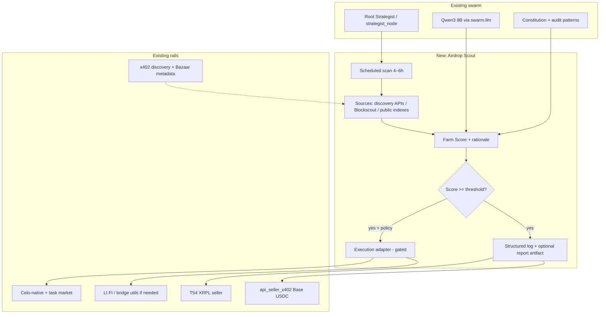

# Airdrop Intelligence Agent — Architecture Map

This document maps the proposed **selective Airdrop Intelligence & Execution** capability onto the existing **Agentic Crypto Swarm** codebase: multi-rail wallets, x402 discovery, Celo/Base bridges, LangGraph orchestration, and live T54 + Base sellers.

**Positioning:** High-signal screening and (optional) execution — **not** a blind “farm everything” bot. Constitution rules apply; sybil-style farming and reputation-harming behavior stay **out of scope**.

---

## 1. Goals

| Goal | Description |
|------|-------------|
| **Intelligence** | Periodic scan of public signals (airdrops, eligibility, TVL, team signals) → **Farm Score 0–100** via LLM + heuristics. |
| **Selectivity** | Only opportunities above a configurable threshold (e.g. **>75**) proceed to human-approved or auto-execution (after burn-in). |
| **Monetization** | New paid SKU: **airdrop intelligence report** (and optional execution assist) on **T54** and/or **Base x402** sellers. |
| **Safety** | Manual approval window, dedicated low-budget wallet for tests, no interaction with unverified contracts by default. |

---

## 2. High-Level Architecture

---

## 3. Mapping to Existing Code

| Concept | Where it lives / plugs in |
|--------|---------------------------|
| **Orchestration loop** | `packages/agents/swarm/graph.py` — `strategist_node` entry; new node or scheduled job **outside** the hot path if soak must not block. |
| **LLM + constitution** | `packages/agents/swarm/llm.py`, `t54_seller_handlers.py` patterns (`run_research_brief`, `run_constitution_audit_lite`), `t54_seller_models.py`. |
| **x402 discovery** | `packages/agents/external_commerce/discovery.py`, `config/x402_providers.json`, `commerce:snapshot` / marketplace priority JSON. |
| **Celo-native buyer** | `packages/agents/external_commerce/celo_native_buyer.py`, `invoker.py`. |
| **Bridge / Base** | `scripts/bridge_utils.py`, `payment_router.py`, env `X402_BRIDGE_*` (see `.env.example`). |
| **Proof / reporting** | `packages/agents/services/proof_bundle.py`, `seller_public_data_bundle.py`, `external_commerce_data/`. |
| **T54 seller SKUs** | `packages/agents/config/t54_seller_skus.json`, `t54_seller_app.py` middleware, `t54_seller_handlers.py`. |
| **Base x402 seller** | `packages/agents/api_seller_x402.py` — add route or reuse bundle pattern for **report-only** JSON. |

**Important:** Long-running **soak** and **seller** processes should not share a process with aggressive network calls. Prefer a **separate worker** (cron, Task Scheduler, or small `python -m` entry) that reads/writes shared **artifacts** only.

---

## 4. Data Sources (Phased)

| Phase | Source | Role |
|-------|--------|------|
| **P0** | Internal research brief / structured query over **curated** URLs you supply | No scraping; constitution-safe. |
| **P1** | Public **HTTP APIs** (Blockscout, DeFiLlama, project docs RSS) — **read-only** | Facts for scoring. |
| **P2** | x402 **discovery** metadata + marketplace snapshot (`run-marketplace-discovery-snapshot.py`) | Ecosystem context, not “airdrop list” by itself. |
| **P3** | Optional **Dune** / **Dune API** (keyed) | If spend and ToS allow. |

**Out of scope for v0:** Automated “web search of everything”; unauthenticated scraping of Discord/Twitter.

---

## 5. Workflow (Autonomous Loop)

1. **Trigger:** Cron every **4–6 hours** (configurable), or manual `POST` for demos.
2. **Ingest:** Fetch normalized “opportunity” records (JSON) from approved sources.
3. **Score:** For each candidate, build a **prompt** with constitution + facts → **Farm Score 0–100** + **short rationale** + **risk flags** (scam, unverified contract, sybil pattern).
4. **Gate:** Default `threshold = 75`; below → log only.
5. **Approval:** **First 2 weeks:** no auto-execution; emit **report artifact** + queue for human review.
6. **Execution (later):** Only on **allowlisted** contract types / chains; **dedicated wallet** with low caps; optional multi-sig or manual confirm step.
7. **Output:** Append to `external_commerce_data/` (JSONL) + optional **paid SKU** payload.

---

## 6. Proposed SKUs (Revenue)

### T54 (`t54_seller_skus.json`)

| Field | Suggested value |
|-------|-----------------|
| `sku_id` | `airdrop-intelligence-report` |
| `path` | `/x402/v1/airdrop-intelligence` (or `/x402/v1/airdrop-report`) |
| `price_drops` | TBD (e.g. 12–25 XRP equivalent in drops — align with `t54_seller_catalog` pricing) |
| `handler` | `airdrop_intelligence_report` (new) |
| **Product** | JSON: last N scored opportunities + wallet-agnostic steps + **disclaimer** (not financial advice; user bears execution risk). |

### Base x402 (`api_seller_x402.py`)

| Option | Notes |
|--------|--------|
| **A** | New route `GET /x402/v1/airdrop-intelligence?depth=standard|full` mirroring **celo-agent-data** pricing pattern (`X402_SELLER_DATA_PRICE` or a new env). |
| **B** | Ship **report only** first; execution never exposed as x402 (manual / internal only). |

Register **`x402_providers.json`** rows + `portal_url` metadata like other SKUs.

---

## 7. Risks & Safeguards (Required)

| Risk | Mitigation |
|------|------------|
| Scams / rugs | Constitution + **no** auto-execute on unverified contracts; **blocklist** patterns. |
| Sybil / reputation | Explicit **non-goal** in docs; no product marketing as “sybil farm helper.” |
| Key exposure | **Dedicated** wallet; env-only keys; never log secrets. |
| Legal / ToS | Disclaimers on reports; respect API terms for DeFiLlama, explorers, etc. |
| Soak / seller stability | **Isolate** Scout worker from **soak** and **uvicorn** processes. |

---

## 8. Implementation Phases (Roughly 1–2 Evenings Each Track)

| Slice | Deliverable |
|-------|-------------|
| **S1** | Doc + config schema: `opportunity.json` shape, `FarmScore` fields, log path under `external_commerce_data/airdrop-scans.jsonl`. |
| **S2** | **Done:** `packages/agents/airdrop_scout/report.py` + `run_airdrop_intelligence_report` in `t54_seller_handlers.py` (LLM-only JSON). |
| **S3** | **Done (T54):** SKU `airdrop-intelligence-report` → `GET /x402/v1/airdrop-intelligence` in `t54_seller_skus.json`. **Base x402** route optional later. |
| **S4** | **Done:** `scripts/run-airdrop-scout.py` (+ `npm run airdrop:scout`) appends to `external_commerce_data/airdrop-scans.jsonl`. Schedule via Task Scheduler / cron — **not** inside soak or sellers. |
| **S5** | Optional: ingest one API (e.g. DeFiLlama) with **read-only** key and rate limits. |
| **S6** | **Done (EVM):** approval-gated claim queue + per-chain routing + LangGraph runner — see `docs/AIRDROP_CLAIM_EXECUTION.md`, `scripts/airdrop-claim-queue.py`, `npm run airdrop:claim`. You supply calldata; protocols are heterogeneous. |

---

## 9. Open Questions

1. **XRPL “via Xaman”** — wallet UX is user-side; automation should use **server-side** keys from env **only** on a dedicated hot wallet with low balance. Confirm policy.
2. **Which chains first** — Celo-only vs Base-only vs **report-only** with no chain execution in v1.
3. **Pricing** — XRP drops vs USDC; match `agent-commerce-data` tiering.

---

## 10. Related Docs

- `docs/X402_EXTERNAL_COMMERCE_ARCHITECTURE.md`
- `docs/X402_MARKETPLACE_INTEGRATION.md` (if present)
- `documentation/x402-t54-base/T54_SELLER.md`
- `external_commerce_data/marketplace_priority.json`
- **Discovery keyword scan (weak signal):** Paginates Coinbase CDP + PayAI x402 discovery APIs, matches airdrop-adjacent keywords, writes `external_commerce_data/discovery-keyword-hits.jsonl`, `docs/discovery-keyword-scan.json`, and `docs/discovery-keyword-scan.md`. Run `npm run discovery:keywords` or `python scripts/scan-discovery-keywords.py`. Use hit URLs as `--context` for `scripts/run-airdrop-scout.py`; keyword hits are **not** a substitute for LLM scoring.
- **Claim execution (EVM, approval-gated):** `docs/AIRDROP_CLAIM_EXECUTION.md` — queue ClaimSpec JSON, `approve`, then `execute` with routing allowlists and `AIRDROP_CLAIMANT_PRIVATE_KEY`. **Local smoke:** `npm run airdrop:claim:demo`. **Celo Sepolia:** `npm run airdrop:claim:testnet` (mock deploy + claim on testnet). **Funding / Coinbase / XRPL → EVM:** same doc + `docs/airdrop_funding_checklist.example.md` (copy to `airdrop_funding_checklist.local.md`, gitignored).

---

*This is an architecture map only; implementation tickets should be split per slice (S1–S6) to avoid destabilizing 24/7 sellers and soak.*
